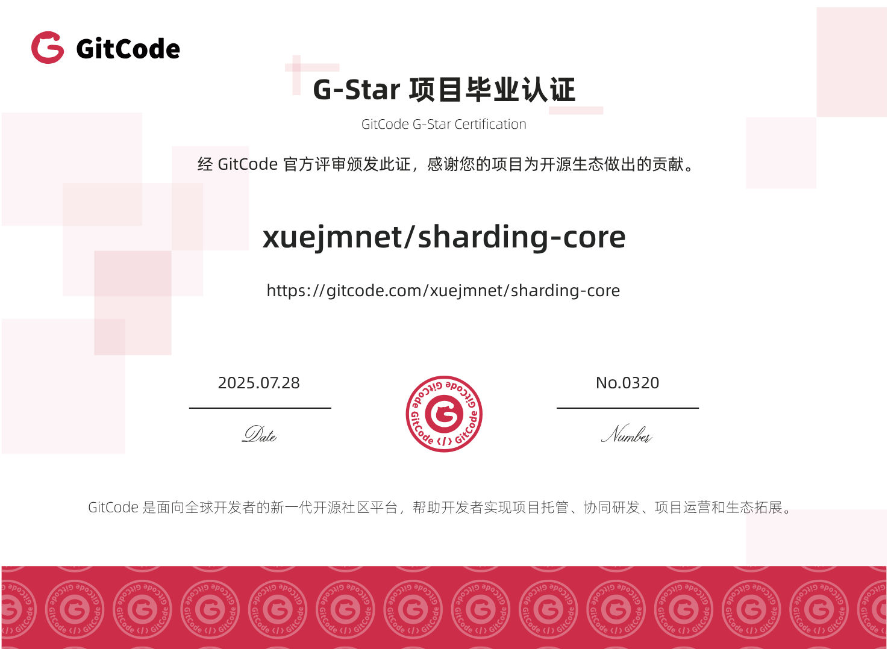

<p align="center">
  
</p>


<p align="center">
    <a target="_blank" href='https://gitee.com/xuejm/sharding-core'>
		
	</a>
    <a target="_blank" href='https://github.com/dotnetcore/sharding-core'>
		
	</a>
      <a href='https://gitcode.com/xuejmnet/sharding-core'></a>
</p>

# [English](https://github.com/dotnetcore/sharding-core/blob/main/README.md) | 中文
# ShardingCore
一款`ef-core`下高性能、轻量级针对分表分库读写分离的解决方案。
- 零依赖
- 零学习成本
- 零业务代码入侵


## 特别用户

<p>
  <a href="https://yxai.chat" target="_blank">
   
  </a>
</p>

全项目基于.Net专业团队自研，源头工厂，价格约是官方的二十分之一不到，获得全网数万用户好评，稳定安全，快速可靠！
①支持 编程/对话/视频/图片/翻译/知识库/插件 直接使用 等等。
②支持全球顶流模型，支持最强编程ClaudeCode/Codex/GeminiCli。
③支持一个key通用claude、gpt、gemini等全站模型。
④包售后，充值后提供1对1售后服务，手把手教玩ai 。
用Ai就选择意心Ai，省心放心爽用！让你不再有Ai焦虑！

- [捐赠](#捐赠)

  

  

## 社区合作伙伴和赞助商

<a href="https://www.jetbrains.com/?from=.NETCoreCommunity(NCC)" target="_blank">

</a>

## 📚 Documentation

[中文文档](https://xuejmnet.github.io/sharding-core-doc/)


## 如何选择版本

- shardingcore 最新版本.efcore版本.x.x

- 版本号第一位是shardingcore的版本号使用最大的即可
- 版本号第二位是efcore版本号使用对应的版本号即可
- 最后两位版本号使用最大即可

- efcore10使用shardingcore7.10.x.x，
- efcore9使用shardingcore7.9.x.x，
- efcore8使用shardingcore7.8.x.x，
- efcore7使用shardingcore7.7.x.x，
- efcore6使用shardingcore7.6.x.x，
- efcore5使用shardingcore7.5.x.x，
- efcore3使用shardingcore7.3.x.x，
- efcore2使用shardingcore7.2.x.x


## Abp.VNext、WTM、FURION 框架集成
- [ShardingFrameWork](https://github.com/xuejmnet/ShardingWithFramework) demos

## 依赖


###  ShardingCore 6.7.0.0之前版本
版本号:a.b.c.d其中,`a`表示efcore版本号

Release  | EF Core | .NET  | .NET (Core) 
--- | --- | --- | --- 
[6.x.x.x](https://www.nuget.org/packages/ShardingCore) |  6.0.0 | net 6.0 | 6.0+ 
[5.x.x.x](https://www.nuget.org/packages/ShardingCore) |  5.0.10 | Standard 2.1 | 5.0+ 
[3.x.x.x](https://www.nuget.org/packages/ShardingCore) | 3.1.18 | Standard 2.0 | 2.0+ 
[2.x.x.x](https://www.nuget.org/packages/ShardingCore) | 2.2.6 | Standard 2.0 | 2.0+ 
### ShardingCore 6.7.0.0之后

版本号:a.b.c.d其中已无相关efcore选择，使用条件编译绑定.net平台,6.7.0.0之后如果您是netcoreapp2那么直接使用efcore2，如果是netcoreapp3那么直接使用efcore3如果是net5就直接用efcore6依次类推

Release  | EF Core | .NET (Core)
--- | --- |  --- 
[6.7.0.0+](https://www.nuget.org/packages/ShardingCore)| 6.x     | net6
[6.7.0.0+](https://www.nuget.org/packages/ShardingCore)| 5.x     | net5 or netstandard2.1
[6.7.0.0+](https://www.nuget.org/packages/ShardingCore)| 3.x     | netcoreapp3 or netstandard2.0
[6.7.0.0+](https://www.nuget.org/packages/ShardingCore)| 2.x     | netcoreapp2


## 快速开始
5步实现按月分表,且支持自动化建表建库
### 第一步安装依赖
选择您的efcore的数据库驱动版本
```shell
# 请对应安装您需要的版本
PM> Install-Package ShardingCore
# use sqlserver
PM> Install-Package Microsoft.EntityFrameworkCore.SqlServer
#  use mysql
#PM> Install-Package Pomelo.EntityFrameworkCore.MySql
# use other database driver,if efcore support
```

### 第二步创建查询对象

查询对象
```csharp

    /// <summary>
    /// order table
    /// </summary>
    public class Order
    {
        /// <summary>
        /// order Id
        /// </summary>
        public string Id { get; set; }
        /// <summary>
        /// payer id
        /// </summary>
        public string Payer { get; set; }
        /// <summary>
        /// pay money cent
        /// </summary>
        public long Money { get; set; }
        /// <summary>
        /// area
        /// </summary>
        public string Area { get; set; }
        /// <summary>
        /// order status
        /// </summary>
        public OrderStatusEnum OrderStatus { get; set; }
        /// <summary>
        /// CreationTime
        /// </summary>
        public DateTime CreationTime { get; set; }
    }
    public enum OrderStatusEnum
    {
        NoPay=1,
        Paying=2,
        Payed=3,
        PayFail=4
    }
```
### 第三步创建dbcontext
dbcontext `AbstractShardingDbContext`和`IShardingTableDbContext`如果你是普通的DbContext那么就继承`AbstractShardingDbContext`需要分表就实现`IShardingTableDbContext`,如果只有分库可以不实现`IShardingTableDbContext`接口
```csharp

    public class MyDbContext:AbstractShardingDbContext,IShardingTableDbContext
    {
        public MyDbContext(DbContextOptions<MyDbContext> options) : base(options)
        {
        }

        protected override void OnModelCreating(ModelBuilder modelBuilder)
        {
            base.OnModelCreating(modelBuilder);
            modelBuilder.Entity<Order>(entity =>
            {
                entity.HasKey(o => o.Id);
                entity.Property(o => o.Id).IsRequired().IsUnicode(false).HasMaxLength(50);
                entity.Property(o=>o.Payer).IsRequired().IsUnicode(false).HasMaxLength(50);
                entity.Property(o => o.Area).IsRequired().IsUnicode(false).HasMaxLength(50);
                entity.Property(o => o.OrderStatus).HasConversion<int>();
                entity.ToTable(nameof(Order));
            });
        }
        /// <summary>
        /// empty impl if use sharding table
        /// </summary>
        public IRouteTail RouteTail { get; set; }
    }
```

### 第四步添加分表路由

```csharp
路由构造函数支持依赖注入,依赖注入的对象生命周期必须是单例
    public class OrderVirtualTableRoute:AbstractSimpleShardingMonthKeyDateTimeVirtualTableRoute<Order>
    {
        /// <summary>
        /// fixed value don't use DateTime.Now because if  if application restart this value where change
        /// </summary>
        /// <returns></returns>
        public override DateTime GetBeginTime()
        {
            return new DateTime(2021, 1, 1);
        }
        /// <summary>
        /// configure sharding property
        /// </summary>
        /// <param name="builder"></param>

        public override void Configure(EntityMetadataTableBuilder<Order> builder)
        {
            builder.ShardingProperty(o => o.CreationTime);
        }
        /// <summary>
        /// enable auto create table job
        /// </summary>
        /// <returns></returns>

        public override bool AutoCreateTableByTime()
        {
            return true;
        }
    }
```

### 第五步配置启动项
无论你是何种数据库只需要修改`AddDefaultDataSource`里面的链接字符串 请不要修改委托内部的UseXXX参数 `conStr` and `connection`
```csharp

        public void ConfigureServices(IServiceCollection services)
        {

            //额外添加分片配置
            services.AddShardingDbContext<MyDbContext>()
                .UseRouteConfig(op =>
                {
                    op.AddShardingTableRoute<OrderVirtualTableRoute>();
                }).UseConfig(op =>
                {
                    op.UseShardingQuery((connStr, builder) =>
                    {
                        //connStr is delegate input param
                        builder.UseSqlServer(connStr);
                    });
                    op.UseShardingTransaction((connection, builder) =>
                    {
                        //connection is delegate input param
                        builder.UseSqlServer(connection);
                    });
                    //use your data base connection string
                    op.AddDefaultDataSource(Guid.NewGuid().ToString("n"),
                        "Data Source=localhost;Initial Catalog=EFCoreShardingTableDB;Integrated Security=True;");
                }).AddShardingCore();
        }

        public void Configure(IApplicationBuilder app, IWebHostEnvironment env)
        {
            if (env.IsDevelopment())
            {
                app.UseDeveloperExceptionPage();
            }
            //not required, enable check table missing and auto create,非必须  启动检查缺少的表并且创建
            app.ApplicationServices.UseAutoTryCompensateTable();
            // other configure....
        }
```
这样所有的配置就完成了你可以愉快地对Order表进行按月分表了

```csharp
[Route("api/[controller]")]
public class ValuesController : Controller
{
        private readonly MyDbContext _myDbContext;

        public ValuesController(MyDbContext myDbContext)
        {
            _myDbContext = myDbContext;
        }

        [HttpGet]
        public async Task<IActionResult> Get()
        {
            var order = await _myDbContext.Set<Order>().FirstOrDefaultAsync(o => o.Id == "2");
            return OK(order)
        }
}
```


## 性能


Test
- on expression compile cache
- ShardingCore x.3.1.63+ version
- efcore 6.0 version
- order id is string, sharding mod(hashcode%5)
- N mean execute count

[Benchmark Demo](https://github.com/xuejmnet/sharding-core/blob/main/benchmarks/ShardingCoreBenchmark/EFCoreCrud.cs)

### 性能损耗 sql server 2012,data rows 7734363 =773w

// * Summary *

BenchmarkDotNet=v0.13.1, OS=Windows 10.0.18363.1500 (1909/November2019Update/19H2)
AMD Ryzen 9 3900X, 1 CPU, 24 logical and 12 physical cores
.NET SDK=6.0.100
[Host]     : .NET 6.0.0 (6.0.21.52210), X64 RyuJIT
DefaultJob : .NET 6.0.0 (6.0.21.52210), X64 RyuJIT


|                             Method |  N |     Mean |     Error |    StdDev |
|----------------------------------- |--- |---------:|----------:|----------:|
| NoShardingIndexFirstOrDefaultAsync | 10 | 1.512 ms | 0.0071 ms | 0.0063 ms |
|   ShardingIndexFirstOrDefaultAsync | 10 | 1.567 ms | 0.0127 ms | 0.0113 ms |

针对未分片数据的查询性能,可以看出10次查询差距为0.05ms,单次查询损耗约为5微妙=0.005毫秒,损耗占比为3%,

结论：efcore 原生查询和sharding-core的查询在针对未分片对象查询上性能可达原先的97%具有极高的性能

### 性能测试


#### sql server 2012,data rows 7734363 =773w

// * Summary *

BenchmarkDotNet=v0.13.1, OS=Windows 10.0.18363.1500 (1909/November2019Update/19H2)
AMD Ryzen 9 3900X, 1 CPU, 24 logical and 12 physical cores
.NET SDK=6.0.101
[Host]     : .NET 6.0.1 (6.0.121.56705), X64 RyuJIT
DefaultJob : .NET 6.0.1 (6.0.121.56705), X64 RyuJIT


|                               Method |  N |       Mean |      Error |     StdDev |
|------------------------------------- |--- |-----------:|-----------:|-----------:|
|   NoShardingIndexFirstOrDefaultAsync | 10 |   1.678 ms |  0.0323 ms |  0.0359 ms |
|     ShardingIndexFirstOrDefaultAsync | 10 |   2.005 ms |  0.0161 ms |  0.0143 ms |
| NoShardingNoIndexFirstOrDefaultAsync | 10 | 495.933 ms |  9.4911 ms | 10.5494 ms |
|   ShardingNoIndexFirstOrDefaultAsync | 10 | 596.112 ms | 11.8907 ms | 13.2165 ms |
|          NoShardingNoIndexCountAsync | 10 | 477.537 ms |  1.4817 ms |  1.2373 ms |
|            ShardingNoIndexCountAsync | 10 | 594.833 ms |  7.4057 ms |  5.7819 ms |
|     NoShardingNoIndexLikeToListAsync | 10 | 665.277 ms |  1.3382 ms |  1.1174 ms |
|       ShardingNoIndexLikeToListAsync | 10 | 840.865 ms | 16.1917 ms | 17.3249 ms |
|         NoShardingNoIndexToListAsync | 10 | 480.368 ms |  1.3688 ms |  1.2134 ms |
|           ShardingNoIndexToListAsync | 10 | 604.850 ms |  8.6204 ms |  8.0635 ms |

#### mysql 5.7,data rows 7553790=755w innerdb_buffer_size=3G


// * Summary *

BenchmarkDotNet=v0.13.1, OS=Windows 10.0.18363.1500 (1909/November2019Update/19H2)
AMD Ryzen 9 3900X, 1 CPU, 24 logical and 12 physical cores
.NET SDK=6.0.101
[Host]     : .NET 6.0.1 (6.0.121.56705), X64 RyuJIT
DefaultJob : .NET 6.0.1 (6.0.121.56705), X64 RyuJIT


|                               Method |  N |          Mean |       Error |      StdDev |
|------------------------------------- |--- |--------------:|------------:|------------:|
|   NoShardingIndexFirstOrDefaultAsync | 10 |      5.646 ms |   0.0164 ms |   0.0145 ms |
|     ShardingIndexFirstOrDefaultAsync | 10 |      5.679 ms |   0.0359 ms |   0.0319 ms |
| NoShardingNoIndexFirstOrDefaultAsync | 10 |  5,212.736 ms | 230.0841 ms | 678.4080 ms |
|   ShardingNoIndexFirstOrDefaultAsync | 10 |  2,013.107 ms |  10.4256 ms |   9.2420 ms |
|          NoShardingNoIndexCountAsync | 10 |  9,483.988 ms |  42.0931 ms |  39.3739 ms |
|            ShardingNoIndexCountAsync | 10 |  2,029.698 ms |  12.4008 ms |  10.9929 ms |
|     NoShardingNoIndexLikeToListAsync | 10 | 10,569.283 ms |  20.9163 ms |  16.3301 ms |
|       ShardingNoIndexLikeToListAsync | 10 |  2,208.804 ms |  11.0483 ms |  10.3346 ms |
|         NoShardingNoIndexToListAsync | 10 |  9,485.263 ms |  21.2558 ms |  17.7496 ms |
|           ShardingNoIndexToListAsync | 10 |  2,012.086 ms |  39.2986 ms |  45.2563 ms |

具体可以通过first前两次结果来计算得出结论单次查询的的损耗为0.04毫秒上下， sqlserver的各项数据在分表和未分表的情况下都几乎差不多可以得出在770w数据集情况下数据库还并未是数据瓶颈的关键，但是mysql可以看到在分表和未分表的情况下如果涉及到没有索引的全表扫描那么性能的差距将是分表后的表数目之多，测试中为5-6倍，也就是分表数目


- [使用介绍](#使用介绍)
    - [简介](#简介)
    - [概念](#概念)
    - [优点](#优点)
    - [缺点](#缺点)
    - [安装](#安装)
- [开始](#开始)
    - [分表](#分表)
    - [分库](#分库)
    - [默认路由](#默认路由)
    - [Api](#Api)
- [高级配置](#高级配置)
    - [code-first](#code-first)
    - [自动追踪](#自动追踪)
    - [手动路由](#手动路由)
    - [自动建表](#自动建表)
    - [事务](#事务)
    - [批量操作](#批量操作)
    - [读写分离](#读写分离)
    - [高性能分页](#高性能分页)
    - [表达式缓存](#表达式缓存)
- [注意事项](#注意事项)
- [计划(Future)](#计划)
- [最后](#最后)

# 使用介绍

以下所有例子都以Sql Server为例 展示的代码均是分表为例,如果需要分库可以参考[Sample.SqlServerShardingDataSource](https://github.com/xuejmnet/sharding-core/tree/main/samples/Sample.SqlServerShardingDataSource) 其他数据库亦是如此


## 简介

简单介绍下这个库,这个库的所有版本都是由对应的efcore版本号为主的版本，第二个版本号如果是2的表示仅支持分库,如果是3+的表示支持分库分表，这个库目前分成两个主要版本一个是main分支一个是shardingTableOnly分支,该库支持分库完全自定义路由适用于95%的业务需求,分表支持x+y+z,x表示固定的表名,y表示固定的表名和表后缀之间的联系(可以为空),z表示表后缀,可以按照你自己的任意业务逻辑进行切分,
如:user_0,user_1或者user202101,user202102...当然该库同样适用于多租户模式下的隔离
支持多种查询包括```join,group by,max,count,min,avg,sum``` ...等一系列查询,之后可能会添加更多支持,目前该库的使用非常简单,基本上就是针对IQueryable的扩展，为了保证
该库的干净零依赖,如果需要实现自动建表需要自己配合定时任务,即可完成24小时无人看管自动管理。该库提供了 [IShardingTableCreator](https://github.com/xuejmnet/sharding-core/blob/main/src/ShardingCore/TableCreator/IShardingTableCreator.cs)
作为建表的依赖,如果需要可以参考 [按天自动建表](https://github.com/xuejmnet/sharding-core/tree/main/samples/Samples.AutoByDate.SqlServer) 该demo是针对分库的动态添加

## 概念

本库的几个简单的核心概念:

### 分库概念
- [DataSourceName]
  数据源名称用来将对象路由到具体的数据源
- [IVirtualDataSource]
  虚拟数据源 [IVirtualDataSource](https://github.com/xuejmnet/sharding-core/blob/main/src/ShardingCore/Core/VirtualDatabase/VirtualDataSources/IVirtualDataSource.cs)
- [IVirtualDataSourceRoute]
  分库路由  [IVirtualDataSourceRoute](https://github.com/xuejmnet/sharding-core/blob/main/src/ShardingCore/Core/VirtualRoutes/DataSourceRoutes/IVirtualDataSourceRoute.cs)
### 分表概念
- [Tail]
  尾巴、后缀物理表的后缀
- [TailPrefix]
  尾巴前缀虚拟表和物理表的后缀中间的字符
- [物理表]
  顾名思义就是数据库对应的实际表信息,表名(tablename+ tailprefix+ tail) [IPhysicTable](https://github.com/xuejmnet/sharding-core/blob/main/src/ShardingCore/Core/PhysicTables/IPhysicTable.cs)
- [虚拟表]
  虚拟表就是系统将所有的物理表在系统里面进行抽象的一个总表对应到程序就是一个entity[IVirtualTable](https://github.com/xuejmnet/sharding-core/blob/main/src/ShardingCore/Core/VirtualDatabase/VirtualTables/IVirtualTable.cs)
- [虚拟路由]
  虚拟路由就是联系虚拟表和物理表的中间介质,虚拟表在整个程序中只有一份,那么程序如何知道要查询系统哪一张表呢,最简单的方式就是通过虚拟表对应的路由[IVirtualTableRoute](https://github.com/xuejmnet/sharding-core/blob/main/src/ShardingCore/Core/VirtualRoutes/TableRoutes/IVirtualTableRoute.cs)
  ,由于基本上所有的路由都是和业务逻辑相关的所以虚拟路由由用户自己实现,该框架提供一个高级抽象

## 优点

- [支持自定义分库]
- [支持读写分离]
- [支持高性能分页]
- [支持手动路由]
- [支持批量操作]
- [支持自定义分表规则]
- [支持任意类型分表key]
- [对dbcontext学习成本0]
- [支持分表下的连表] ```join,group by,max,count,min,avg,sum```
- [支持针对批处理的使用] [EFCore.BulkExtensions](https://github.com/borisdj/EFCore.BulkExtensions) ...支持efcore的扩展生态
- [提供多种默认分表规则路由] 按时间,按取模 可自定义
- [针对分页进行优化] 大页数跳转支持低内存流式处理，高性能分页

## 缺点
- [消耗连接]出现分表与分表对象进行join如果条件没法索引到具体表会生成```笛卡尔积```导致连接数爆炸,后期会进行针对该情况的配置

## 安装
```xml
<PackageReference Include="ShardingCore" Version="5.LastVersion" />
or
<PackageReference Include="ShardingCore" Version="3.LastVersion" />
or
<PackageReference Include="ShardingCore" Version="2.LastVersion" />
```

# 开始
## 分表

我们以用户取模来做例子,配置entity 推荐 [fluent api](https://docs.microsoft.com/en-us/ef/core/modeling/) 

```c#
    public class SysUserMod 
    {
        /// <summary>
        /// 用户Id用于分表
        /// </summary>
        public string Id { get; set; }
        /// <summary>
        /// 用户名称
        /// </summary>
        public string Name { get; set; }
        /// <summary>
        /// 用户姓名
        /// </summary>
        public int Age { get; set; }
    }
    
```
创建virtual route
实现 `AbstractShardingOperatorVirtualTableRoute<T, TKey>`
抽象,或者实现系统默认的虚拟路由
框架默认有提供几个简单的路由 [默认路由](#默认路由)

```c#

    public class SysUserModVirtualTableRoute : AbstractSimpleShardingModKeyStringVirtualRoute<SysUserMod>
    {
        //2 tail length:00,01,02......99
        //3 hashcode % 3: [0,1,2]
        public SysUserModVirtualTableRoute() : base(2,3)
        {
        }
        public override void Configure(EntityMetadataTableBuilder<SysUserMod> builder)
        {
            builder.ShardingProperty(o => o.Id);
        }
    }
```

如果你使用分表必须创建一个继承自```IShardingTableDbContext```接口的DbContext,
必须实现```IShardingDbContext```,默认提供了AbstractShardingDbContext

```c#

  //DefaultTableDbContext is acutal execute dbcontext
    public class DefaultShardingDbContext:AbstractShardingDbContext,IShardingTableDbContext
    {
        public DefaultShardingDbContext(DbContextOptions<DefaultShardingDbContext> options) : base(options)
        {
        }

        protected override void OnModelCreating(ModelBuilder modelBuilder)
        {
            base.OnModelCreating(modelBuilder);
            modelBuilder.ApplyConfiguration(new SysUserModMap());
        }
        public IRouteTail RouteTail { get; set; }

    }
```
`Startup.cs` 下的 `ConfigureServices(IServiceCollection services)`

```c#

        public void ConfigureServices(IServiceCollection services)
        {
            services.AddControllers();
            //if u want use no sharding operate
            //services.AddDbContext<DefaultTableDbContext>(o => o.UseSqlServer("Data Source=localhost;Initial Catalog=ShardingCoreDB;Integrated Security=True"));

    //add shardingdbcontext support life scope
                
        services.AddShardingDbContext<DefaultShardingDbContext>(
                   (conStr, builder) => builder.UseSqlServer(conStr)
                )
                .Begin(o =>
                {
                    o.CreateShardingTableOnStart = true;//create sharding table
                    o.EnsureCreatedWithOutShardingTable = true;//create data source with out sharding table
                })  .AddShardingTransaction((connection, builder) =>
                    builder.UseSqlServer(connection))
                .AddDefaultDataSource("ds0", "Data Source=localhost;Initial Catalog=ShardingCoreDB1;Integrated Security=True;")
                .AddShardingTableRoute(o =>
                {
                    o.AddShardingTableRoute<SysUserModVirtualTableRoute>();
                }).End();
```

`Startup.cs` 下的 ` Configure(IApplicationBuilder app, IWebHostEnvironment env)` 你也可以自行封装[app.UseShardingCore()](https://github.com/xuejmnet/sharding-core/blob/main/samples/Sample.SqlServer/DIExtension.cs)

```c#

            var shardingBootstrapper = app.ApplicationServices.GetRequiredService<IShardingBootstrapper>();
            shardingBootstrapper.Start();
```
如何使用
```c#
    
        private readonly DefaultShardingDbContext _defaultShardingDbContext;

        public ctor(DefaultShardingDbContext defaultShardingDbContext)
        {
            _defaultShardingDbContext = defaultShardingDbContext;
        }

        public async Task Insert_1000()
        {
            if (!_defaultShardingDbContext.Set<SysUserMod>().Any())
                {
                    var ids = Enumerable.Range(1, 1000);
                    var userMods = new List<SysUserMod>();
                    foreach (var id in ids)
                    {
                        userMods.Add(new SysUserMod()
                        {
                            Id = id.ToString(),
                            Age = id,
                            Name = $"name_{id}",
                            AgeGroup = Math.Abs(id % 10)
                        });
                    }

                    _defaultShardingDbContext.AddRange(userMods);

                   await _defaultShardingDbContext.SaveChangesAsync();
                }
        }
        public async Task ToList_All()
        {
            
            var mods = await _defaultShardingDbContext.Set<SysUserMod>().ToListAsync();
            Assert.Equal(1000, mods.Count);

            var modOrders1 = await _defaultShardingDbContext.Set<SysUserMod>().OrderBy(o => o.Age).ToListAsync();
            int ascAge = 1;
            foreach (var sysUserMod in modOrders1)
            {
                Assert.Equal(ascAge, sysUserMod.Age);
                ascAge++;
            }

            var modOrders2 = await _defaultShardingDbContext.Set<SysUserMod>().OrderByDescending(o => o.Age).ToListAsync();
            int descAge = 1000;
            foreach (var sysUserMod in modOrders2)
            {
                Assert.Equal(descAge, sysUserMod.Age);
                descAge--;
            }
        }
```
## 分库

我们还是以用户取模来做例子,配置entity 推荐 [fluent api](https://docs.microsoft.com/en-us/ef/core/modeling/) 
`IShardingDataSource`数据库对象必须继承该接口
`ShardingDataSourceKey`分库字段需要使用该特性

```c#
    public class SysUserMod 
    {
        /// <summary>
        /// 用户Id用于分库
        /// </summary>
        public string Id { get; set; }
        /// <summary>
        /// 用户名称
        /// </summary>
        public string Name { get; set; }
        /// <summary>
        /// 用户姓名
        /// </summary>
        public int Age { get; set; }
    }
    
```
创建virtual route
实现 `AbstractShardingOperatorVirtualTableRoute<T, TKey>`
抽象,或者实现系统默认的虚拟路由
框架默认有提供几个简单的路由 [默认路由](#默认路由)

```c#

    
    public class SysUserModVirtualDataSourceRoute:AbstractShardingOperatorVirtualDataSourceRoute<SysUserMod,string>
    {
        protected readonly int Mod=3;
        protected readonly int TailLength=1;
        protected readonly char PaddingChar='0';

        protected override string ConvertToShardingKey(object shardingKey)
        {
            return shardingKey.ToString();
        }

        public override string ShardingKeyToDataSourceName(object shardingKey)
        {
            var shardingKeyStr = ConvertToShardingKey(shardingKey);
            return "ds"+Math.Abs(ShardingCoreHelper.GetStringHashCode(shardingKeyStr) % Mod).ToString().PadLeft(TailLength, PaddingChar); ;
        }

        public override List<string> GetAllDataSourceNames()
        {
            return new List<string>()
            {
                "ds0",
                "ds1",
                "ds2"
            };
        }

    public override void Configure(EntityMetadataDataSourceBuilder<SysUserMod> builder)
    {
        builder.ShardingProperty(o => o.Name);
    }

        public override bool AddDataSourceName(string dataSourceName)
        {
            throw new NotImplementedException();
        }

        protected override Expression<Func<string, bool>> GetRouteToFilter(string shardingKey, ShardingOperatorEnum shardingOperator)
        {

            var t = ShardingKeyToDataSourceName(shardingKey);
            switch (shardingOperator)
            {
                case ShardingOperatorEnum.Equal: return tail => tail == t;
                default:
                {
                    return tail => true;
                }
            }
        }
    }
```

如果你使用分库就不需要```IShardingTableDbContext```接口的DbContext
创建分表DbContext必须继承AbstractShardingDbContext


```c#

  //DefaultTableDbContext is acutal execute dbcontext
    public class DefaultShardingDbContext:AbstractShardingDbContext
    {
        public DefaultShardingDbContext(DbContextOptions<DefaultShardingDbContext> options) : base(options)
        {
        }

        protected override void OnModelCreating(ModelBuilder modelBuilder)
        {
            base.OnModelCreating(modelBuilder);
            modelBuilder.ApplyConfiguration(new SysUserModMap());
        }

    }
```
`Startup.cs` 下的 `ConfigureServices(IServiceCollection services)`

```c#

        public void ConfigureServices(IServiceCollection services)
        {
            services.AddControllers();

    //add shardingdbcontext support life scope
                
       services.AddShardingDbContext<DefaultShardingDbContext>(
                   (conStr, builder) => builder.UseSqlServer(conStr)
                ).Begin(o =>
                {
                    o.CreateShardingTableOnStart = true;
                    o.EnsureCreatedWithOutShardingTable = true;
                })
                .AddShardingTransaction((connection, builder) =>
                    builder.UseSqlServer(connection))
                .AddDefaultDataSource("ds0","Data Source=localhost;Initial Catalog=ShardingCoreDBxx0;Integrated Security=True;")
                .AddShardingDataSource(sp =>
                {
                    return new Dictionary<string, string>()
                    {
                        {"ds1", "Data Source=localhost;Initial Catalog=ShardingCoreDBxx1;Integrated Security=True;"},
                        {"ds2", "Data Source=localhost;Initial Catalog=ShardingCoreDBxx2;Integrated Security=True;"},
                    };
                }).AddShardingDataSourceRoute(o =>
                {
                    o.AddShardingDatabaseRoute<SysUserModVirtualDataSourceRoute>();
                }).End();
```

`Startup.cs` 下的 ` Configure(IApplicationBuilder app, IWebHostEnvironment env)` 你也可以自行封装[app.UseShardingCore()](https://github.com/xuejmnet/sharding-core/blob/main/samples/Sample.SqlServer/DIExtension.cs)

```c#

            var shardingBootstrapper = app.ApplicationServices.GetRequiredService<IShardingBootstrapper>();
            shardingBootstrapper.Start();
```
如何使用
```c#
    
        private readonly DefaultShardingDbContext _defaultShardingDbContext;

        public ctor(DefaultShardingDbContext defaultShardingDbContext)
        {
            _defaultShardingDbContext = defaultShardingDbContext;
        }

        public async Task Insert_1000()
        {
            if (!_defaultShardingDbContext.Set<SysUserMod>().Any())
                {
                    var ids = Enumerable.Range(1, 1000);
                    var userMods = new List<SysUserMod>();
                    foreach (var id in ids)
                    {
                        userMods.Add(new SysUserMod()
                        {
                            Id = id.ToString(),
                            Age = id,
                            Name = $"name_{id}",
                            AgeGroup = Math.Abs(id % 10)
                        });
                    }

                    _defaultShardingDbContext.AddRange(userMods);

                   await _defaultShardingDbContext.SaveChangesAsync();
                }
        }
        public async Task ToList_All()
        {
            
            var mods = await _defaultShardingDbContext.Set<SysUserMod>().ToListAsync();
            Assert.Equal(1000, mods.Count);

            var modOrders1 = await _defaultShardingDbContext.Set<SysUserMod>().OrderBy(o => o.Age).ToListAsync();
            int ascAge = 1;
            foreach (var sysUserMod in modOrders1)
            {
                Assert.Equal(ascAge, sysUserMod.Age);
                ascAge++;
            }

            var modOrders2 = await _defaultShardingDbContext.Set<SysUserMod>().OrderByDescending(o => o.Age).ToListAsync();
            int descAge = 1000;
            foreach (var sysUserMod in modOrders2)
            {
                Assert.Equal(descAge, sysUserMod.Age);
                descAge--;
            }
        }
```
更多操作可以参考单元测试

## Api

方法  | Method | [Unit Test](https://github.com/xuejmnet/sharding-core/blob/main/test/ShardingCore.Test50/ShardingTest.cs) 
--- |--- |--- 
获取集合 |ToListAsync |yes 
第一条 |FirstOrDefaultAsync |yes 
最大 |MaxAsync |yes 
最小 |MinAsync |yes 
是否存在 |AnyAsync |yes 
数目 |CountAsync |yes 
数目 |LongCountAsync |yes 
求和 |SumAsync |yes 
平均 |AverageAsync |yes 
包含 |ContainsAsync |yes 
分组 |GroupByAsync |yes 

## 默认路由
分库提供了默认的路由分表则需要自己去实现,具体实现可以参考分库

抽象abstract | 路由规则 | tail | 索引
--- |--- |--- |--- 
AbstractSimpleShardingModKeyIntVirtualTableRoute |取模 |0,1,2... | `=,contains`
AbstractSimpleShardingModKeyStringVirtualTableRoute |取模 |0,1,2... | `=,contains`
AbstractSimpleShardingDayKeyDateTimeVirtualTableRoute |按时间 |yyyyMMdd | `>,>=,<,<=,=,contains`
AbstractSimpleShardingDayKeyLongVirtualTableRoute |按时间戳 |yyyyMMdd | `>,>=,<,<=,=,contains`
AbstractSimpleShardingWeekKeyDateTimeVirtualTableRoute |按时间 |yyyyMMdd_dd | `>,>=,<,<=,=,contains`
AbstractSimpleShardingWeekKeyLongVirtualTableRoute |按时间戳 |yyyyMMdd_dd | `>,>=,<,<=,=,contains`
AbstractSimpleShardingMonthKeyDateTimeVirtualTableRoute |按时间 |yyyyMM | `>,>=,<,<=,=,contains`
AbstractSimpleShardingMonthKeyLongVirtualTableRoute |按时间戳 |yyyyMM | `>,>=,<,<=,=,contains`
AbstractSimpleShardingYearKeyDateTimeVirtualTableRoute |按时间 |yyyy | `>,>=,<,<=,=,contains`
AbstractSimpleShardingYearKeyLongVirtualTableRoute |按时间戳 |yyyy | `>,>=,<,<=,=,contains`

注:`contains`表示为`o=>ids.contains(o.shardingkey)`
注:使用默认的按时间分表的路由规则会让你重写一个GetBeginTime的方法这个方法必须使用静态值如:new DateTime(2021,1,1)不可以用动态值比如DateTime.Now因为每次重新启动都会调用该方法动态情况下会导致每次都不一致

# 高级

## code-first
目前`sharding-core`已经支持code first支持代码现行，具体实现可以参考[Migrations](https://github.com/xuejmnet/sharding-core/tree/main/samples/Sample.Migrations/readme.md)

## 自动追踪
默认shardingcore不支持自动追踪,并且也不建议使用自动追踪,如果你有需要shardingcore也默认提供了自动追踪功能
有两点需要注意
目前仅支持单主键对象
1.shardingcore仅支持dbcontext的model的类型的整个查询匿名类型不支持联级查询不支持
2.shardingcore的单个查询依然走数据库不走缓存如果查询出来的结果缓存里面有就返回缓存里面的而不是数据库的
3.tolist等操作会查询数据库返回的时候判断是否已经追踪如果已经追踪则返回缓存里已经追踪了的值
4.支持 `first`,`firstordefault`,`last`,`lastordefault`,`single`,`singleordefault`
如何开启
```c#
services.AddShardingDbContext<DefaultShardingDbContext>(.......)
            .Begin(o => {
                    o.CreateShardingTableOnStart = true;
                    o.EnsureCreatedWithOutShardingTable = true;
                    //autotrack support asnotracking astracking QueryTrackingBehavior.TrackAll
                    o.AutoTrackEntity = true; 
                })
```

## 手动路由
```c#
ctor inject IShardingRouteManager shardingRouteManager

    public class SysUserModVirtualTableRoute : AbstractSimpleShardingModKeyStringVirtualTableRoute<SysUserMod>
    {
        /// <summary>
        /// 开启提示路由
        /// </summary>
        protected override bool EnableHintRoute => true;

        public SysUserModVirtualTableRoute() : base(2,3)
        {
        }
    }


    

    using (_shardingRouteManager.CreateScope())
    {
        _shardingRouteManager.Current.TryCreateOrAddMustTail<SysUserMod>("00");

        var mod00s = await _defaultTableDbContext.Set<SysUserMod>().Skip(10).Take(11).ToListAsync();
    }
```

## 自动建表
[参考](https://github.com/xuejmnet/sharding-core/tree/main/samples/Samples.AutoByDate.SqlServer)

## 事务
1.默认savechanges支持事务
```c#

 await  _defaultShardingDbContext.SaveChangesAsync();
     
```
2.手动开启事务 [请参考微软](https://docs.microsoft.com/zh-cn/ef/core/saving/transactions)
```c#
            using (var tran = _defaultTableDbContext.DataBase.BeginTransaction())
            {
                    ........
                _defaultTableDbContext.SaveChanges();
                tran.Commit();
            }
```


## 批量操作

批量操作将对应的dbcontext和数据进行分离由用户自己选择第三方框架比如[`Z.EntityFramework.Plus.EFCore`](https://github.com/zzzprojects/EntityFramework-Plus) 进行批量操作或者 [`EFCore.BulkExtensions`](https://github.com/borisdj/EFCore.BulkExtensions) ,支持一切三方批量框架
```c#
var list = new List<SysUserMod>();
///通过集合返回出对应的k-v归集通过事务开启
            var dbContexts = _defaultTableDbContext.BulkShardingEnumerable(list);

           
                    foreach (var dataSourceMap in dbContexts)
                    {
                        foreach (var tailMap in dataSourceMap.Value)
                        {
                            tailMap.Key.BulkInsert(tailMap.Value.ToList());
                            //tailMap.Key.BulkDelete(tailMap.Value.ToList());
                            //tailMap.Key.BulkUpdate(tailMap.Value.ToList());
                        }
                    }
                _defaultTableDbContext.SaveChanges();
          //or
            var dbContexts = _defaultTableDbContext.BulkShardingEnumerable(list);
            using (var tran = _defaultTableDbContext.Database.BeginTransaction())
            {
                    foreach (var dataSourceMap in dbContexts)
                    {
                        foreach (var tailMap in dataSourceMap.Value)
                        {
                            tailMap.Key.BulkInsert(tailMap.Value.ToList());
                            //tailMap.Key.BulkDelete(tailMap.Value.ToList());
                            //tailMap.Key.BulkUpdate(tailMap.Value.ToList());
                        }
                    }
                _defaultTableDbContext.SaveChanges();
                tran.Commit();
            }

```
## code-first

## 读写分离
该框架目前已经支持一主多从的读写分离`AddReadWriteSeparation`,支持轮询 Loop和随机 Random两种读写分离策略,又因为读写分离多链接的时候会导致数据读写不一致,(如分页其实是2步第一步获取count，第二部获取list)会导致数据量在最后几页出现缺量的问题,
针对这个问题框架目前实现了自定义读链接获取策略`ReadConnStringGetStrategyEnum.LatestEveryTime`表示为每次都是新的(这个情况下会出现上述问题),`ReadConnStringGetStrategyEnum.LatestFirstTime`表示以dbcontext作为单位获取一次(同dbcontext不会出现问题),
又因为各节点读写分离网络等一系列问题会导致刚刚写入的数据没办法获取到所以系统默认在dbcontext上添加是否使用读写分离如果false默认选择写字符串去读取`_defaultTableDbContext.ReadWriteSeparation=false`或者使用两个封装好的方法
```c#
 //切换到只读数据库，只读数据库又只配置了A数据源读取B数据源
            _virtualDbContext.ReadWriteSeparationReadOnly();
            _virtualDbContext.ReadWriteSeparationWriteOnly();
```

```c#
services.AddShardingDbContext<DefaultShardingDbContext>(
                    (conStr, builder) => builder.UseSqlServer(conStr).UseLoggerFactory(efLogger)
                ).Begin(o =>
                {
                    o.CreateShardingTableOnStart = true;
                    o.EnsureCreatedWithOutShardingTable = true;
                })
                .AddShardingTransaction((connection, builder) =>
                    builder.UseSqlServer(connection).UseLoggerFactory(efLogger))
                .AddDefaultDataSource("ds0",
                    "Data Source=localhost;Initial Catalog=ShardingCoreDB1;Integrated Security=True;")
                .AddShardingTableRoute(o =>
                {
                    o.AddShardingTableRoute<SysUserModVirtualTableRoute>();
                }).AddReadWriteSeparation(o =>
                {
                    return new Dictionary<string, ISet<string>>()
                    {
                        {
                            "ds0", new HashSet<string>(){
                            "Data Source=localhost;Initial Catalog=ShardingCoreDBReadOnly1;Integrated Security=True;",
                            "Data Source=localhost;Initial Catalog=ShardingCoreDBReadOnly2;Integrated Security=True;"}
                        }
                    };
                }, ReadStrategyEnum.Loop,defaultEnable:true).End();

            _virtualDbContext.ReadWriteSeparationReadOnly();
                //reslove read write delay data not found
                //dbcontext use write connection string 
            _virtualDbContext.ReadWriteSeparationWriteOnly();
```

## 高性能分页
sharding-core本身使用流式处理获取数据在普通情况下和单表的差距基本没有,但是在分页跳过X页后,性能会随着X的增大而减小O(n)
目前该框架已经实现了一套高性能分页可以根据用户配置,实现分页功能。

支持版本`x.2.0.16+`

1.如何开启分页配置 比如我们针对用户月新表进行分页配置,先实现`IPaginationConfiguration<>`接口,该接口是分页配置接口
```c#

    public class SysUserSalaryPaginationConfiguration:IPaginationConfiguration<SysUserSalary>
    {
        public void Configure(PaginationBuilder<SysUserSalary> builder)
        {
            builder.PaginationSequence(o => o.Id)
                .UseRouteCompare(Comparer<string>.Default)
                .UseQueryMatch(PaginationMatchEnum.Owner | PaginationMatchEnum.Named | PaginationMatchEnum.PrimaryMatch);
            builder.PaginationSequence(o => o.DateOfMonth)
                .UseQueryMatch(PaginationMatchEnum.Owner | PaginationMatchEnum.Named | PaginationMatchEnum.PrimaryMatch).UseAppendIfOrderNone(10);
            builder.PaginationSequence(o => o.Salary)
                .UseQueryMatch(PaginationMatchEnum.Owner | PaginationMatchEnum.Named | PaginationMatchEnum.PrimaryMatch).UseAppendIfOrderNone();
            builder.ConfigReverseShardingPage(0.5d,10000L);
        }
    }
```
2.添加配置
在对应的用户路由中添加配置 [XXXXXXVirtualTableRoute]
```c#
        public override IPaginationConfiguration<SysUserSalary> CreatePaginationConfiguration()
        {
            return new SysUserSalaryPaginationConfiguration();
        }
```
3.Configure内部为什么意思?
1) builder.PaginationSequence(o => o.Id) 配置当分页orderby 字段为Id时那么分表所对应的表结构为顺序,顺序的规则通过`UseRouteCompare`来设置,其中string为表tail 或 data source name,
具体什么意思就是说如果本次分页设计3张表分别是table1,table2,table3,如果我没配置id的情况下那么需要查询3张表然后分别进行流式聚合,如果我配置了id的情况下,如果本次sql查询带上了id作为order by字段
   那么就不需要分别查询3张表,可以直接查询table1如果table1的count大于你要跳过的页数,假设分页查询先查询多少条,table1:100条,table2:200条,table3:300条
   如果你要跳过90条获取10条原先的时间就是O(100)现在的时间就是O(10)因为table1跳过了90条还剩余10条;
2) `UseQueryMatch`是什么意思,这个就是表示你要匹配的规则,是必须是当前这个类下的属性还是说只需要排序名称一样即可,因为有可能select new{}匿名对象类型就会不一样,`PrimaryMatch`表示是否只需要第一个主要的
orderby匹配上就行了,`UseAppendIfOrderNone`表示是否需要开启在没有对应order查询条件的前提下添加本属性排序,这样可以保证顺序排序性能最优
3) `builder.ConfigReverseShardingPage` 表示是否需要启用反向排序,因为正向排序在skip过多后会导致需要跳过的数据过多,尤其是最后几页,如果开启其实最后几页就是前几页的反向排序,其中第一个参数表示跳过的因子,就是说
skip必须大于分页总total*该因子(0-1的double),第二个参数表示最少需要total多少条必须同时满足两个条件才会开启(必须大于500),并且反向排序优先级低于顺序排序,
4.如何使用
 ```c#
var shardingPageResultAsync = await _defaultTableDbContext.Set<SysUserMod>().OrderBy(o=>o.Age).ToShardingPageAsync(pageIndex, pageSize);
```
### 注意:如果你是按时间排序无论何种排序建议开启并且加上时间顺序排序,如果你是取模或者自定义分表,建议将Id作为顺序排序,如果没有特殊情况请使用id排序并且加上反向排序作为性能优化,如果entity同时支持分表分库并且两个路由都支持同一个属性的顺序排序优先级为先分库后分表

## 表达式缓存
可以通过路由开启表达式缓存针对单个tail的表达式进行缓存支持=,>,>=,<,<=,equal
```c#

   public  class OrderCreateTimeVirtualTableRoute:AbstractSimpleShardingMonthKeyDateTimeVirtualTableRoute<Order>
    {
        //开启表达式缓存
        public override bool EnableRouteParseCompileCache => true;
    }
```
针对表达式缓存可以自行重写父类方法来自行实现，也可以仅实现多tail表达式`AbstractShardingRouteParseCompileCacheVirtualTableRoute`,`AbstractShardingRouteParseCompileCacheVirtualDataSourceRoute`
```c#
        public virtual Func<string, bool> CachingCompile(Expression<Func<string, bool>> parseWhere)
        {
            if (EnableRouteParseCompileCache)
            {
                var doCachingCompile = DoCachingCompile(parseWhere);
                if (doCachingCompile != null)
                    return doCachingCompile;
                doCachingCompile = CustomerCachingCompile(parseWhere);
                if (doCachingCompile != null)
                    return doCachingCompile;
            }
            return parseWhere.Compile();
        }
        /// <summary>
        /// 系统默认永久单表达式缓存
        /// </summary>
        /// <param name="parseWhere"></param>
        /// <returns>返回null会走<see cref="CustomerCachingCompile"/>这个方法如果还是null就会调用<see cref="Compile"/>方法</returns>
        protected virtual Func<string, bool> DoCachingCompile(Expression<Func<string, bool>> parseWhere)
        {
            var shouldCache = ShouldCache(parseWhere);
            if(shouldCache)
                return _routeCompileCaches.GetOrAdd(parseWhere, key => parseWhere.Compile());
            return null;
        }
        protected virtual Func<string, bool> CustomerCachingCompile(Expression<Func<string, bool>> parseWhere)
        {
            return null;
        }
```

开启表达式缓存可以将路由模块的编译由原先的0.14ms升级到0.013ms提示约0.13ms将近10倍性能

# 注意事项
使用该框架需要注意两点如果你的shardingdbcontext重写了以下服务可能无法使用 如果还想使用需要自己重写扩展[请参考](https://github.com/xuejmnet/sharding-core/blob/main/src/ShardingCore/DIExtension.cs)
1.shardingdbcontext
```c#
   return optionsBuilder.UseShardingWrapMark()
                .ReplaceService<IDbSetSource, ShardingDbSetSource>()
                .ReplaceService<IQueryCompiler, ShardingQueryCompiler>()
                .ReplaceService<IDbContextTransactionManager, ShardingRelationalTransactionManager<TShardingDbContext>>()
                .ReplaceService<IRelationalTransactionFactory, ShardingRelationalTransactionFactory<TShardingDbContext>>();
```
2.defaultdbcontext
```c#
return optionsBuilder.ReplaceService<IModelCacheKeyFactory, ShardingModelCacheKeyFactory>()
                .ReplaceService<IModelCustomizer, ShardingModelCustomizer<TShardingDbContext>>();

```
,目前框架采用AppDomain.CurrentDomain.GetAssemblies();
可能会导致程序集未被加载所以尽可能在api层加载所需要的dll
使用时需要注意
- 分表实体对象是否继承`IShardingTable`
- 分表实体对象是否有`ShardingKey`
- 分库实体对象是否继承`IShardingDataSource`
- 分库实体对象是否有`ShardingDataSourceKey`
- 实体对象是否已经实现了一个虚拟路由
- startup是否已经添加虚拟路由
- startup是否已经添加bootstrapper.start()

```c#
//支持最终修改
            var sresult =  _defaultTableDbContext.Set<SysUserMod>().ToList();

            var sysUserMod98 = result.FirstOrDefault(o => o.Id == "98");
            sysUserMod98.Name = "name_update"+new Random().Next(1,99)+"_98";
            await _defaultTableDbContext.SaveChangesAsync();
--log info
  Executed DbCommand (1ms) [Parameters=[@p1='?' (Size = 128), @p0='?' (Size = 128)], CommandType='Text', CommandTimeout='30']
      SET NOCOUNT ON;
      UPDATE [SysUserMod_02] SET [Name] = @p0
      WHERE [Id] = @p1;
      SELECT @@ROWCOUNT;
```


# 计划
- [提供官网如果该项目比较成功的话]
- [开发更完善的文档]
- [重构成支持.net其他orm]

# 最后
该框架借鉴了大部分分表组件的思路,目前提供的接口都已经实现,并且支持跨表查询,基于分页查询该框架也使用了流式查询保证不会再skip大数据的时候内存会爆炸,目前这个库只是一个刚刚成型的库还有很多不完善的地方希望大家多多包涵,如果喜欢的话也希望大家给个star.
该文档是我晚上赶工赶出来的也想趁热打铁希望更多的人关注,也希望更多的人可以交流。

凭借各大开源生态圈提供的优秀代码和思路才有的这个框架,希望可以为.Net生态提供一份微薄之力,该框架本人会一直长期维护,有大神技术支持可以联系下方方式欢迎star :)

# 捐赠


[博客](https://www.cnblogs.com/xuejiaming)

QQ群:771630778

个人QQ:326308290(欢迎技术支持提供您宝贵的意见)

个人邮箱:326308290@qq.com