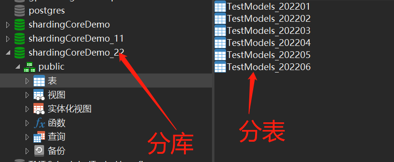
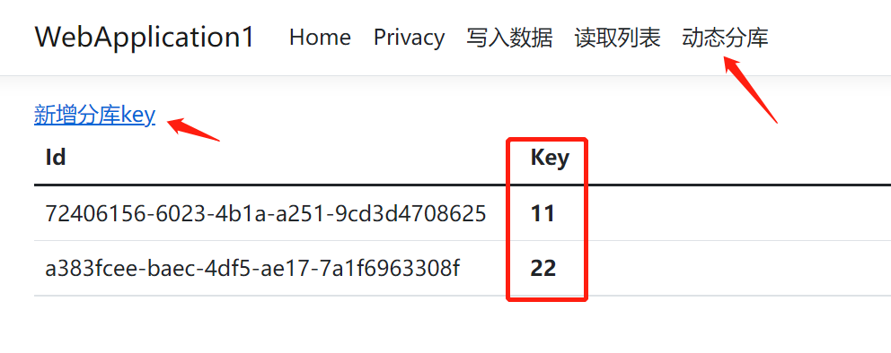
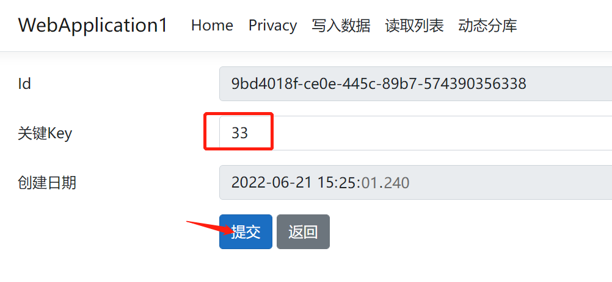
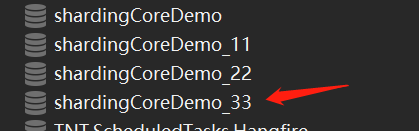

# ShardingCoreDemo

[ShardingCore](https://github.com/dotnetcore/sharding-core) step by step，记录 shardingcore 学习及使用过程，记录从原始无 shardingcore 到 分库且分表的配置升级，数据读写的过程

本示例数据源使用的是 Npgsql，使用 sqlserver，mysql 的可以更改其相应的数据驱动

> 项目的 commit 记录既是项目升级改造的历史步骤。

## 目录介绍

```txt
├── WebApplication1                            webapp 项目
├── WebApplication1.Data                       存储数据模型和dbcontext的项目（一些公用的方法也存储在这个项目中）
├── WebApplication1.Migrations.NoSharding      未分片前的迁移程序集项目
├── WebApplication1.Migrations.Sharding        分片后的迁移程序集项目
├── WebApplication1.Migrations.Tool            迁移工具项目，在tool项目下可利用 ef tool 完成迁移文件的创建
```

## 分支介绍

```txt
├── master        主分支，从一个正常的ef codefirst 项目，到使用 sharingcore 分库(静态)分表 的过程
├── 动态分库       动态分库分支，由于动态分库会移除掉静态分库的部分内容，所以单独分支存在，在完成静态分库后创建
```

### master 分支

详细查看分支 [commit](https://gitee.com/dodu/sharding-core-demo/commits/master) 记录

### 动态分库 分支

在主库有一个维护动态库的表：TestModelKey，维护更新时，动态同步到配置文件 muitDbConfig.json，这个配置文件名的配置请参考 [TestModelVirtualDataSourceRoute.cs](https://gitee.com/dodu/sharding-core-demo/blob/%E5%8A%A8%E6%80%81%E5%88%86%E5%BA%93/WebApplication1.Data/Sharding/TestModelVirtualDataSourceRoute.cs)，在 WebApplication1/bin/net 6.0 目录下。

如果本地未生成库时，请在 tool 项目目录下，使用 ef tool 命令来做数据库的初始迁移(包含分库分表)，需要将 WebApplication1/bin/net 6.0 目录下的 muitDbConfig.json 拷贝到 WebApplication1.Migrations.Tool/bin/net 6.0 目录下，以供 tool 项目使用，当然也可以利用其他持久化方法。如果本地已经存在完整的库(包含分库)，则可直接运行 webapp 项目

本示例采用的是 postgresql 引擎，默认的最大链接数是 100，如果分库数量大于 100 时，运行时会报 pgsql 53300 异常，超出最大链接数，需要修改引擎配置。max_connection，根据自己需要自行调整。

初始化后的库结构如下：



之后启动 webapp 项目，就可以动态来维护分库，这根据每个人的业务需要，这里针对分库的维护，专门做了示例：






